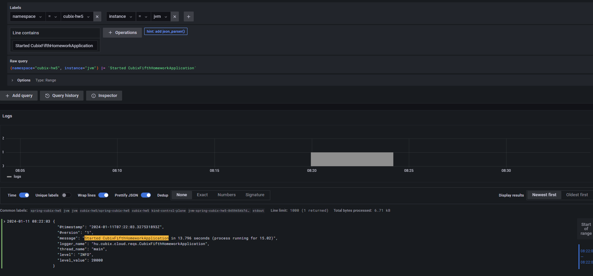
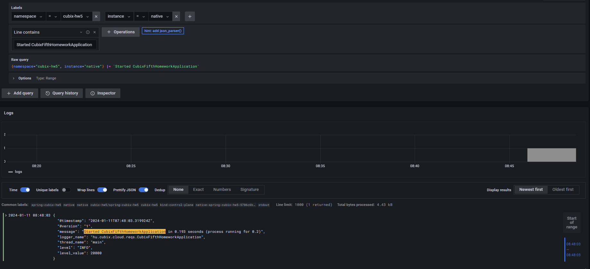

# Create namespace
- kubectl create namespace cubix-hw5

# Logging methode
- válaszott metodus a clude nate alapelvek szerint mindenképp JSon a strúktőrálhatóság miatt, ami a filter és aggregáció miatt könnyen kezelhet a grafanabán.

# jvm
helm install jvm spring-cubix-hw5 -f jvm.yaml  -n cubix-hw5

# filter 
Raw query
{namespace="cubix-hw5", instance="jvm"} |= `Started CubixFifthHomeworkApplication`

# delete 
helm delete jvm -n cubix-hw5   

# Native app install
helm install native spring-cubix-hw5 -f native.yaml  -n cubix-hw5

# filter 
Raw query
{namespace="cubix-hw5", instance="native"} |= `Started CubixFifthHomeworkApplication`

